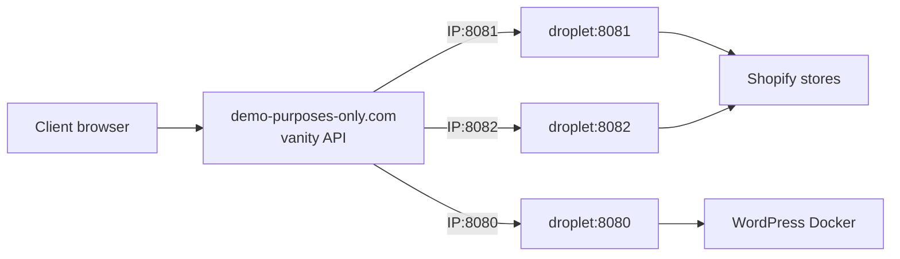

# Client feedback preview (not production)

Private demos for client feedback only. Do **not** attach production brand domains, wire real payments, or treat these URLs as go-live.

Routing is **not** manual DNS. [`demo-purposes-only.com`](https://demo-purposes-only.com) maps a vanity hostname to **`IP:PORT`** via its API. One DigitalOcean droplet can expose three ports; you register three vanities against that droplet.

## Client-facing URLs

| Site | Vanity URL | Droplet listens on (example) |
| --- | --- | --- |
| Bac water market | `https://bacwatermarket.demo-purposes-only.com` | `DROPLET_IP:8081` |
| Fast peptide testing | `https://fastpeptidetesting.demo-purposes-only.com` | `DROPLET_IP:8082` |
| Noviq peptides | `https://noviqpeptides.demo-purposes-only.com` | `DROPLET_IP:8080` |

Never share `bacwatermarket.com`, `fastpeptidetesting.com`, or `noviqpeptides.com` for this round.



---

## Part 0: Vanity registration (demo-purposes-only.com API)

After the droplet is up and each port is serving:

1. Note the droplet public **IPv4**.
2. Confirm each service answers on its port (`curl -I http://DROPLET_IP:8080`, etc.).
3. Call your **demo-purposes-only.com API** to bind:

| Vanity | Target |
| --- | --- |
| `bacwatermarket` | `DROPLET_IP:8081` |
| `fastpeptidetesting` | `DROPLET_IP:8082` |
| `noviqpeptides` | `DROPLET_IP:8080` |

TLS and the public hostname are handled by the demo platform. The droplet only needs plain HTTP on those ports (plus firewall allow for the chosen ports and SSH).

If you have a preferred curl/CLI snippet for the API, keep it next to your secrets (not in git) and paste the same shape for each of the three vanities.

---

## Part A: Shopify (bac + fpt) on droplet ports

Dawn Liquid still needs Shopify’s runtime. On the droplet, each brand is a **local port that reverse-proxies to that brand’s development store** (`*.myshopify.com`). The client only ever sees the vanity URL.

### A1. Two separate development stores

Partner (or trial) stores, one per brand. No shared branding, no cross-links.

Fill `environments.development.store` in:

- [`bacwatermarket/shopify.theme.toml`](../bacwatermarket/shopify.theme.toml)
- [`fastpeptidetesting/shopify.theme.toml`](../fastpeptidetesting/shopify.theme.toml)

### A2. Push themes (always unpublished first)

```bash
cd bacwatermarket && npx shopify theme push --unpublished
cd ../fastpeptidetesting && npx shopify theme push --unpublished
```

On each **development** store:

1. Publish the preview theme as that store’s live theme.
2. **Password protect** the storefront (Preferences).
3. Leave production brand domains disconnected.
4. Keep **Show client preview banner** on (also auto-shows when the request host contains `demo-purposes-only.com`).

Do **not** connect Shopify custom domains to `*.demo-purposes-only.com`. The vanity layer fronts the droplet ports instead.

### A3. Port proxies on the droplet

Use the shared Caddy preview config in [`noviqpeptides/deploy/preview/`](../noviqpeptides/deploy/preview/) (or equivalent). Example env:

```bash
BAC_SHOPIFY_HOST=your-bac-store.myshopify.com
FPT_SHOPIFY_HOST=your-fpt-store.myshopify.com
BAC_PREVIEW_PORT=8081
FPT_PREVIEW_PORT=8082
NOVIQ_PREVIEW_PORT=8080
```

Caddy listens on `8081` / `8082` and proxies to each myshopify host (with the correct `Host` header). Register those ports with the vanity API.

Storefront password is still Shopify’s gate; share it in the client note.

---

## Part B: Noviq Peptides on the droplet (port 8080)

Configs: [`noviqpeptides/deploy/preview/`](../noviqpeptides/deploy/preview/).

### B1. Droplet prerequisites

- Ubuntu + Docker Compose
- Firewall: SSH + the three preview ports (e.g. 8080–8082). No need to open 80/443 on the droplet if vanities terminate TLS off-box.
- Repo (or theme/plugin/local/preview) on the server

### B2. Secrets and env

```bash
cd noviqpeptides/deploy/preview
cp .env.example .env
./hash-password.sh 'CHOOSE_A_STRONG_PASSWORD'
# Copy the printed PREVIEW_BASIC_AUTH_HASH=$$2a$$... line into .env
```

In `noviqpeptides/local/.env`:

- `WORDPRESS_URL=https://noviqpeptides.demo-purposes-only.com`
- `WORDPRESS_BIND=127.0.0.1`
- `WORDPRESS_PORT=18080` (host bind for WP; leave `8080` free for Caddy’s Noviq listener)
- Strong admin + MySQL passwords (do not share WP admin with the client unless needed)

### B3. Start stack

```bash
cd noviqpeptides/local
docker compose \
  -f docker-compose.yml \
  -f ../deploy/preview/compose.preview.yml \
  --env-file ../deploy/preview/.env \
  --env-file .env \
  up -d

./setup.sh
```

Then register `noviqpeptides` → `DROPLET_IP:8080` via the vanity API.

Click through: age gate, shop, cart, empty `/coa`. Confirm basic auth and the preview banner.

---

## Part C: Client handoff message (template)

```text
Private demos on demo-purposes-only.com for feedback only.
Not public. Not the live sites. Please do not share outside your team.
No real orders or payments on these previews.

--- Bac water market ---
URL: https://bacwatermarket.demo-purposes-only.com
Storefront password: [SHOPIFY_PASSWORD]

--- Fast peptide testing ---
URL: https://fastpeptidetesting.demo-purposes-only.com
Storefront password: [SHOPIFY_PASSWORD]

--- Noviq peptides ---
URL: https://noviqpeptides.demo-purposes-only.com
HTTP basic auth user: client
HTTP basic auth password: [BASIC_AUTH_PASSWORD]
```

---

## Part D: Teardown

1. **Vanity API:** remove or disable the three vanity → IP:PORT bindings.
2. **Shopify:** pause/delete development stores or keep them password-gated; turn off **Show client preview banner** before any production brand domain.
3. **Droplet:**
   ```bash
   cd noviqpeptides/local
   docker compose \
     -f docker-compose.yml \
     -f ../deploy/preview/compose.preview.yml \
     --env-file ../deploy/preview/.env \
     --env-file .env \
     down
   ```
   Rotate basic-auth and WP admin if the stack may return.
4. Destroy or power off the droplet when the feedback round is done.

---

## Removable preview banners

| Surface | How it shows | How to remove |
| --- | --- | --- |
| Shopify (bac / fpt) | Auto on `*.demo-purposes-only.com`, or theme setting **Show client preview banner** | Uncheck setting; snippet [`snippets/client-preview-banner.liquid`](../bacwatermarket/snippets/client-preview-banner.liquid) |
| WordPress (noviq) | Demo host in `home_url`, or `NOVIQ_CLIENT_PREVIEW` | Stop preview compose / non-demo `WORDPRESS_URL` |

---

## Out of scope for this preview

- Production brand domains
- Real payment / banking credentials
- Bare live theme push on a production store
- Cross-linking or co-branding Shopify stores with noviqpeptides
- Manual DNS for `demo-purposes-only.com` (use the vanity API)
