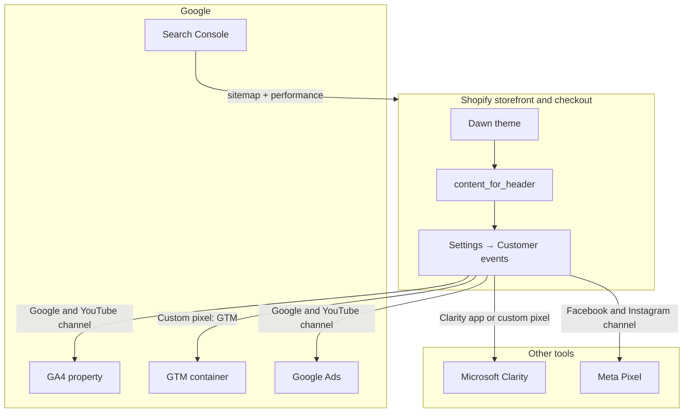

# March Analytics: analytics and measurement

Brand: March Analytics  
Site: `fastpeptidetesting/` → fastpeptidetesting.com  
Platform: Shopify (Dawn)  
Store: `srgkrj-ij.myshopify.com` (preview; production handle TBD)

This runbook configures GA4, Google Search Console, Google Tag Manager, Microsoft Clarity, and optional ad pixels **without theme changes**. Per [specs/02-fastpeptidetesting.md](../specs/02-fastpeptidetesting.md), measurement is installed through Shopify admin apps and **Settings → Customer events**, not Liquid or theme scripts.

**Related docs:**

- [fpt-shopify-dns.md](fpt-shopify-dns.md) — DNS and domain launch (Search Console verification may use the same registrar/Cloudflare access)
- [fpt-policies-and-documents.md](fpt-policies-and-documents.md) — policies to verify after go-live
- [specs/10-intake.md](../specs/10-intake.md) — block F: analytics IDs (all TBD until the client supplies them)

---

## Architecture



**Why not theme scripts:** Pixels registered in Customer events load on the storefront **and** checkout (including purchase). Theme `theme.liquid` snippets do not reliably cover checkout, and this repo's spec forbids hardcoding trackers in the theme.

The theme already exposes `{{ content_for_header }}` in `fastpeptidetesting/layout/theme.liquid`. Shopify injects channel apps and custom pixels there. No theme edit is required.

---

## Intake checklist (all TBD)

Collect these from the client before executing the steps below. Record answers in [specs/10-intake.md](../specs/10-intake.md) block F.

| # | Item | Placeholder | Notes |
| --- | --- | --- | --- |
| F1 | Google account for March Analytics only | TBD | **Must not** reuse noviqpeptides.com or bacwatermarket.com Google accounts. Separate brand, separate measurement. |
| F2 | GA4 measurement ID | `G-TBD` | One property for fastpeptidetesting.com only. |
| F3 | GTM container ID | `GTM-TBD` | Optional if GA4 via Google & YouTube channel is enough; use when the client wants a tag hub for future tools. |
| F4 | Microsoft Clarity project ID | `CLARITY_PROJECT_ID_TBD` | Free heatmaps and session recordings. |
| F5 | Google Ads tag / conversion IDs | TBD | Only if the client pursues paid search after compliance review. |
| F6 | Meta Pixel ID | TBD | Only if the client pursues paid social after compliance review. |

**Do not invent IDs.** Every placeholder in this doc must be replaced with a real value from the client before saving pixels or connecting channels.

---

## 1. Create the Google account and GA4 property (client)

The client creates these assets. Developer executes Shopify connection once IDs exist.

1. Sign in to [Google Analytics](https://analytics.google.com/) with a **new or dedicated** Google account for March Analytics (intake F1). Do not link this property to noviqpeptides or bacwatermarket accounts.
2. **Admin → Create → Property**
   - Property name: `March Analytics` or `fastpeptidetesting.com`
   - Reporting time zone and currency: match the Shopify store (typically US / USD)
3. **Create a Web data stream**
   - Website URL: `https://fastpeptidetesting.com`
   - Stream name: `fastpeptidetesting.com`
4. Copy the **Measurement ID** (`G-XXXXXXXXXX`) into intake F2.

Recommended GA4 settings after the stream exists:

- **Enhanced measurement:** leave defaults on (page views, scrolls, outbound clicks) unless counsel objects.
- **Google signals:** off until the client explicitly wants cross-device ads reporting.
- **Data retention:** Event data → 14 months (or client preference documented in intake).

---

## 2. Connect GA4 in Shopify (Google & YouTube channel)

1. In Shopify admin for `srgkrj-ij.myshopify.com`, open **Sales channels → Google & YouTube** (install from the Shopify App Store if missing).
2. Connect the Google account from step 1.
3. Link the GA4 property (measurement ID `G-…` from F2).
4. Confirm **one** GA4 property is connected for this store only.

**Ecommerce events** (view item, add to cart, begin checkout, purchase) are sent automatically by the channel app. Do not duplicate GA4 pageview tags in a custom pixel unless you have a documented reason and have disabled overlapping tags in GTM.

**Consent:** If the store uses Shopify's customer privacy banner, analytics respect consent signals from the Google & YouTube integration. Do not bypass with theme scripts.

---

## 3. Google Search Console

Prerequisites: `fastpeptidetesting.com` is the primary domain and the storefront password is off (see [fpt-shopify-dns.md](fpt-shopify-dns.md)).

### Verify ownership

**Option A (preferred):** In Search Console, add property `https://fastpeptidetesting.com`. If the Google account is already linked via Google & YouTube, choose **Domain** or **URL prefix** verification through the connected Google account when offered.

**Option B (DNS TXT):** If Search Console shows a TXT verification record:

1. Open Cloudflare → zone `fastpeptidetesting.com` → **DNS → Records** (same flow as [fpt-shopify-dns.md](fpt-shopify-dns.md) step 2).
2. Add the TXT record Search Console provides at `@` (or the host name shown).
3. Set **Proxy status** to **DNS only** (gray cloud).
4. Return to Search Console and click **Verify**.

### Submit sitemap

1. In Search Console → **Sitemaps**, submit: `https://fastpeptidetesting.com/sitemap.xml`
2. Confirm status **Success** after Shopify has generated the sitemap (usually within 24 hours of domain go-live).

### Post-launch checks (from spec SEO checklist)

- `/robots.txt` — crawlers not blocked
- `/sitemap.xml` — returns XML
- `/llms.txt` and `/agents.md` — lab-service wording, no cross-brand links

---

## 4. Google Tag Manager (custom web pixel)

Use GTM when the client wants a central place to add tags later without editing Shopify pixels each time. **GA4 should still be connected via the Google & YouTube channel** (section 2); use GTM for supplemental tags or server-side forwarding the client configures inside GTM.

### Sandbox caveats

Custom pixels run in Shopify's **lax sandbox** (sandboxed iframe). Implications:

- Legacy script tags (GTM loader, Clarity loader) generally work inside the iframe.
- Tags that scrape or modify the **top-frame** DOM will not work.
- GTM **Preview** mode behaves differently than on a non-Shopify site; validate with GA4 Realtime and the Shopify pixel debugger (section 7).
- Prefer **event-driven** GTM tags (Custom Event triggers on `dataLayer` pushes below), not DOM-based triggers.

### Install

1. Create a GTM container at [tagmanager.google.com](https://tagmanager.google.com/) in the same Google account as GA4 (F1).
2. Copy the container ID (`GTM-XXXXXXX`) into intake F3.
3. In Shopify admin: **Settings → Customer events → Add custom pixel**.
4. Name: `GTM - March Analytics`
5. Paste the code below, replacing `GTM-TBD` with the real container ID.
6. **Permission:** Analytics = On. Marketing = On only if GTM will fire ads/remarketing tags (coordinate with section 6).
7. **Save** and **Connect**.

```javascript
// Replace with intake F3 before saving.
const GTM_CONTAINER_ID = 'GTM-TBD';

window.dataLayer = window.dataLayer || [];

(function (w, d, s, l, i) {
  w[l] = w[l] || [];
  w[l].push({ 'gtm.start': new Date().getTime(), event: 'gtm.js' });
  var f = d.getElementsByTagName(s)[0];
  var j = d.createElement(s);
  var dl = l !== 'dataLayer' ? '&l=' + l : '';
  j.async = true;
  j.src = 'https://www.googletagmanager.com/gtm.js?id=' + i + dl;
  f.parentNode.insertBefore(j, f);
})(window, document, 'script', 'dataLayer', GTM_CONTAINER_ID);

function mapCheckoutLineItems(lineItems) {
  if (!lineItems || !lineItems.length) return [];
  return lineItems.map(function (item) {
    var variant = item.variant || item.merchandise;
    return {
      item_id: variant && (variant.sku || variant.id),
      item_name: item.title || (variant && variant.product && variant.product.title),
      quantity: item.quantity,
      price: item.finalLinePrice
        ? parseFloat(item.finalLinePrice.amount)
        : variant && variant.price
          ? parseFloat(variant.price.amount)
          : undefined,
    };
  });
}

function pushEcommerce(eventName, currency, value, items) {
  window.dataLayer.push({
    event: eventName,
    ecommerce: {
      currency: currency,
      value: value,
      items: items,
    },
  });
}

analytics.subscribe('page_viewed', function (event) {
  window.dataLayer.push({
    event: 'page_view',
    page_location: event.context && event.context.document && event.context.document.location
      ? event.context.document.location.href
      : undefined,
    page_title: event.context && event.context.document ? event.context.document.title : undefined,
  });
});

analytics.subscribe('product_viewed', function (event) {
  var variant = event.data.productVariant;
  if (!variant) return;
  pushEcommerce(
    'view_item',
    variant.price.currencyCode,
    parseFloat(variant.price.amount),
    [
      {
        item_id: variant.sku || variant.id,
        item_name: variant.product.title,
        item_variant: variant.title,
        price: parseFloat(variant.price.amount),
      },
    ]
  );
});

analytics.subscribe('product_added_to_cart', function (event) {
  var line = event.data.cartLine;
  if (!line || !line.merchandise) return;
  var m = line.merchandise;
  pushEcommerce(
    'add_to_cart',
    m.price.currencyCode,
    parseFloat(line.cost.totalAmount.amount),
    [
      {
        item_id: m.sku || m.id,
        item_name: m.product.title,
        quantity: line.quantity,
        price: parseFloat(m.price.amount),
      },
    ]
  );
});

analytics.subscribe('checkout_started', function (event) {
  var checkout = event.data.checkout;
  if (!checkout) return;
  pushEcommerce(
    'begin_checkout',
    checkout.currencyCode,
    parseFloat(checkout.totalPrice && checkout.totalPrice.amount ? checkout.totalPrice.amount : 0),
    mapCheckoutLineItems(checkout.lineItems)
  );
});

analytics.subscribe('checkout_completed', function (event) {
  var checkout = event.data.checkout;
  if (!checkout) return;
  window.dataLayer.push({
    event: 'purchase',
    ecommerce: {
      transaction_id: checkout.order && checkout.order.id,
      currency: checkout.currencyCode,
      value: parseFloat(checkout.totalPrice && checkout.totalPrice.amount ? checkout.totalPrice.amount : 0),
      tax: checkout.totalTax && checkout.totalTax.amount ? parseFloat(checkout.totalTax.amount) : undefined,
      shipping:
        checkout.shippingLine && checkout.shippingLine.price && checkout.shippingLine.price.amount
          ? parseFloat(checkout.shippingLine.price.amount)
          : undefined,
      items: mapCheckoutLineItems(checkout.lineItems),
    },
  });
});
```

### GTM container setup (inside tagmanager.google.com)

After the pixel is connected:

1. Create **GA4 Configuration** or **GA4 Event** tags only if not already fully covered by the Google & YouTube channel (avoid duplicate purchase events).
2. Add triggers on Custom Event names: `page_view`, `view_item`, `add_to_cart`, `begin_checkout`, `purchase`.
3. Publish the GTM container version with a clear name (e.g. `FPT initial`).

Event payload reference: [Shopify Web Pixels API — Standard events](https://shopify.dev/docs/api/web-pixels-api/standard-events).

---

## 5. Microsoft Clarity

### Recommended: Clarity Shopify app

1. Install **Microsoft Clarity** from the Shopify App Store.
2. Sign in with a Microsoft account dedicated to March Analytics (or the client's chosen account).
3. Create or link a Clarity project for `fastpeptidetesting.com`.
4. Copy the project ID into intake F4.

The app integrates outside the strict custom-pixel sandbox and is better suited to heatmaps and recordings than a hand-rolled pixel.

### Fallback: custom web pixel

Use only if the app is unavailable. Session recordings may be incomplete because custom pixels run in a sandboxed iframe without access to the top-frame DOM.

1. Create a project at [clarity.microsoft.com](https://clarity.microsoft.com/).
2. **Settings → Customer events → Add custom pixel**
3. Name: `Clarity - March Analytics`
4. Paste (replace `CLARITY_PROJECT_ID_TBD`):

```javascript
const CLARITY_PROJECT_ID = 'CLARITY_PROJECT_ID_TBD';

(function (c, l, a, r, i, t, y) {
  c[a] =
    c[a] ||
    function () {
      (c[a].q = c[a].q || []).push(arguments);
    };
  t = l.createElement(r);
  t.async = 1;
  t.src = 'https://www.clarity.ms/tag/' + i;
  y = l.getElementsByTagName(r)[0];
  y.parentNode.insertBefore(t, y);
})(window, document, 'clarity', 'script', CLARITY_PROJECT_ID);
```

5. Permission: Analytics = On. Marketing = Off unless counsel approves.
6. **Save** and **Connect**.

---

## 6. Ad pixels (optional; client sign-off required)

March Analytics sells **laboratory testing services**, not peptides. Ad platforms still often restrict peptide-adjacent and research-compound wording. **Do not enable Google Ads or Meta campaigns** until the client and counsel approve copy and targeting.

### Google Ads

1. Use the same **Google & YouTube** channel connection (section 2).
2. Link the Google Ads account when the client is ready (intake F5).
3. Configure conversion actions in Google Ads; the channel can share ecommerce events with Ads when linking is complete.
4. Ad copy must stay within testing-services framing (no health claims, no dosage, no therapeutic language).

### Meta (Facebook / Instagram)

1. Install **Facebook & Instagram** from the Shopify App Store.
2. Connect the client's Meta Business account.
3. Enter the Pixel ID (intake F6) when prompted.
4. Enable **Conversions API** through the channel if offered (recommended for accuracy).
5. Marketing permission on pixels must be On for Meta; ensure the privacy banner reflects marketing cookies.

**Compliance:** No cross-links to noviqpeptides.com or bacwatermarket.com in ad landing experiences. Each brand must appear unrelated to processors and regulators.

---

## 7. Verification

Run after all IDs are real and the domain is live (or on the preview store for partial checks).

| Check | How |
| --- | --- |
| GA4 realtime | GA4 → Reports → Realtime. Open the storefront in a private window; confirm `page_view` and engagement. |
| GA4 purchase | Place a **test order** (Shopify test gateway or small real order per client policy). Confirm `purchase` in GA4 within minutes (Google & YouTube channel). |
| Shopify pixel log | **Settings → Customer events** → select each pixel → view recent activity / test in Shopify's pixel helper. |
| GTM dataLayer | Browser devtools → select the custom-pixel iframe (if visible) → confirm `dataLayer` pushes on add to cart. GTM Preview may be limited; trust GA4 Realtime for end-to-end. |
| Clarity | Clarity dashboard → check session count within ~30 minutes of browsing. |
| Search Console | Sitemap status Success; URL Inspection on homepage and one product page. |
| Cross-brand | Confirm no shared GA/GTM/Clarity containers with other client sites. |

**Test order note:** FPT sells non-physical lab services. A completed test checkout is the only reliable way to validate `checkout_completed` / `purchase`.

---

## 8. What not to do

| Do not | Why |
| --- | --- |
| Add gtag, GTM, or Clarity snippets to `theme.liquid` or sections | Spec requires Customer events; theme scripts miss checkout |
| Reuse noviqpeptides or bacwatermarket GA/GTM/Clarity accounts | Cross-brand measurement violates separation constraints |
| Invent measurement IDs in repo or theme settings | Intake F2–F6 are client-owned TBDs |
| Enable aggressive ad pixels before counsel review | Platform policy risk for peptide-adjacent businesses |
| Duplicate GA4 purchase tags in GTM and Google & YouTube | Inflated conversion counts |

---

## Definition of done

- Intake block F filled with real IDs (or explicitly still TBD with owner named).
- GA4 property connected via Google & YouTube channel for this store only.
- Search Console verified; `sitemap.xml` submitted.
- GTM custom pixel connected with real `GTM-…` ID (if client uses GTM).
- Clarity recording via app (or fallback pixel with real project ID).
- Ad pixels documented as off or connected with written client approval.
- Test order confirms purchase event in GA4.
- No theme files modified for tracking.
