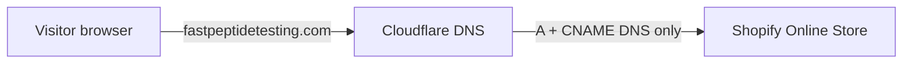

# Fast Peptide Testing: DNS and Shopify domain setup

March Analytics launch on Shopify store **`srgkrj-ij.myshopify.com`** → **`fastpeptidetesting.com`**.

This document is the DNS runbook. Registrar and Shopify admin steps are included only where they affect DNS.

**Prerequisites (already done):** paid Shopify plan, Shopify Payments active, client sign-off on theme and content.

**Related docs:**

- [fpt-policies-and-documents.md](fpt-policies-and-documents.md) — policies and pages to verify after the domain is live
- [client-preview.md](client-preview.md) — tear down droplet / `demo-purposes-only.com` preview DNS if you used it

---

## Architecture



- **GoDaddy** holds domain registration. Nameservers point to **Cloudflare** (already configured).
- **Cloudflare** holds the DNS records that route traffic to Shopify.
- **Shopify** hosts the storefront, checkout, and TLS for the custom domain once DNS verifies.

Do **not** point `fastpeptidetesting.com` at a preview droplet or proxy through orange-cloud Cloudflare for this launch.

---

## Step 1: Start domain connection in Shopify

1. Log in to **Shopify Admin** for `srgkrj-ij.myshopify.com`.
2. Go to **Settings → Domains**.
3. Click **Connect existing domain**.
4. Enter `fastpeptidetesting.com` (apex only; Shopify will also handle `www`).
5. Shopify shows the **exact DNS records** required for your store. **Copy those values.** Do not use generic examples from old blog posts; Shopify may show store-specific verification TXT records.

Typical records Shopify asks for:

| Type | Name / Host | Value | Notes |
| --- | --- | --- | --- |
| **A** | `@` | `23.227.38.65` | Apex → Shopify. Use the IP Shopify displays if it differs. |
| **CNAME** | `www` | `shops.myshopify.com` | `www` subdomain → Shopify. |
| **TXT** | `@` or `_shopify` | (verification string) | Only if Shopify shows one during setup. Remove or leave after verified per Shopify’s UI. |

Leave this Shopify screen open until Cloudflare records are saved.

---

## Step 2: Configure DNS in Cloudflare

1. Log in to [Cloudflare](https://dash.cloudflare.com).
2. Select the zone **`fastpeptidetesting.com`**.
3. Open **DNS → Records**.

### 2.1 Remove conflicting records

Delete or edit any existing records that would compete with Shopify:

| Remove or change | Why |
| --- | --- |
| **A** or **AAAA** on `@` pointing to a droplet, parking page, or old host | Traffic would miss Shopify |
| **CNAME** on `www` pointing elsewhere | `www` would not reach Shopify |
| **CNAME** on `@` (apex) unless Cloudflare flattening to Shopify | Can conflict with Shopify’s A record |
| Records from the [client preview](client-preview.md) setup | Preview used a different routing path |

### 2.2 Add Shopify records

Add each record Shopify listed in Step 1.

**Cloudflare field mapping:**

| Cloudflare | Shopify / DNS |
| --- | --- |
| Type | A, CNAME, or TXT |
| Name | `@` for apex, `www` for www |
| IPv4 address / Target | Value from Shopify |
| Proxy status | **DNS only** (grey cloud) |
| TTL | Auto |

### 2.3 Proxy status: grey cloud only

Set **every** Shopify-related record to **DNS only** (grey cloud), **not** proxied (orange cloud).

Orange-cloud proxy often breaks Shopify domain verification and SSL provisioning. You can revisit proxy settings later; for launch, stay on DNS only.

### 2.4 Example Cloudflare table (after setup)

| Type | Name | Content | Proxy |
| --- | --- | --- | --- |
| A | `@` | `23.227.38.65` | DNS only |
| CNAME | `www` | `shops.myshopify.com` | DNS only |
| TXT | `@` | `shopify-verification=...` | DNS only (if required) |

Values must match **Settings → Domains** in Shopify, not this table.

---

## Step 3: Wait for Shopify verification

1. Return to **Shopify Admin → Settings → Domains**.
2. Click **Verify connection** or wait for automatic checks.
3. Status should change to **Connected** (often 15–60 minutes; allow up to 48 hours).

**While waiting**, confirm propagation from your machine:

```bash
dig fastpeptidetesting.com A +short
dig www.fastpeptidetesting.com CNAME +short
```

Expected:

- Apex A record → Shopify’s IP (e.g. `23.227.38.65`).
- `www` CNAME → `shops.myshopify.com` (or Shopify’s canonical target).

If results show an old IP or host, wait for TTL expiry or fix the Cloudflare record.

---

## Step 4: Set primary domain in Shopify

After **Connected**:

1. **Settings → Domains**
2. Set **`fastpeptidetesting.com`** or **`www.fastpeptidetesting.com`** as **Primary** (client preference; apex without `www` is common).
3. Confirm the non-primary hostname **redirects** to primary.
4. Confirm domain **Target** = **Online Store** (default for this Dawn storefront).

Shopify issues and renews TLS for the custom domain after DNS is correct. No manual certificate upload in Cloudflare for DNS-only mode.

---

## Step 5: Verify HTTPS and routing

Open in a browser (incognito avoids cache):

| URL | Expected |
| --- | --- |
| `https://fastpeptidetesting.com` | March Analytics storefront, valid HTTPS |
| `https://www.fastpeptidetesting.com` | Redirects to primary |
| `http://fastpeptidetesting.com` | Redirects to HTTPS |

If you still see a password page, that is normal until you disable the storefront password (Step 6). DNS is working if the URL resolves to Shopify and the certificate is valid.

---

## Step 6: Go live (after DNS works)

These are not DNS steps but complete the launch once the domain resolves:

1. **Online Store → Themes** — publish theme `fpt-preview` if not already live.
2. **Online Store → Preferences** — disable storefront password when ready for public traffic.
3. **Online Store → Themes → Customize → Theme settings** — confirm **Show client preview banner** is off.
4. Place a test order on `https://fastpeptidetesting.com` and confirm checkout has **no shipping method** (products must be non-physical).

Theme push from the repo (if needed before publish):

```bash
cd fastpeptidetesting
npx shopify theme push --unpublished --theme fpt-preview --store srgkrj-ij.myshopify.com
```

Review the preview URL, then publish in Admin. Do not run a bare `theme push` on the live theme.

---

## Troubleshooting

| Symptom | Likely cause | Fix |
| --- | --- | --- |
| Shopify stuck on “Not connected” | Wrong record values or typo in host name | Re-copy from **Settings → Domains**; `@` vs `www` |
| SSL / certificate errors | Orange-cloud proxy on | Set A and CNAME to **DNS only** |
| Site shows old preview / wrong server | A record still points at droplet IP | Update or delete old A record in Cloudflare |
| `www` works, apex does not (or reverse) | Missing A or CNAME | Add the record Shopify shows for the broken host |
| Long delay after correct DNS | TTL / propagation | Wait; check with `dig` from multiple resolvers |
| Shopify shows connected but wrong store | Domain on wrong Shopify store | Each domain connects to one store only; use `srgkrj-ij` |

---

## Preview teardown (if applicable)

If `fastpeptidetesting.com` previously pointed at a preview droplet:

1. Remove **demo-purposes-only.com** vanity bindings ([client-preview.md](client-preview.md)).
2. Replace droplet A records in Cloudflare with Shopify records above.
3. Do **not** add `fastpeptidetesting.com` as a custom domain in Shopify during preview-only demos; for production launch, the domain **must** connect to Shopify as described here.

---

## Quick checklist

- [ ] GoDaddy nameservers → Cloudflare (done)
- [ ] **Settings → Domains → Connect** `fastpeptidetesting.com` in Shopify
- [ ] Add A `@` → Shopify IP in Cloudflare (**DNS only**)
- [ ] Add CNAME `www` → `shops.myshopify.com` in Cloudflare (**DNS only**)
- [ ] Add TXT if Shopify requires verification
- [ ] Remove old A/CNAME records (droplet, parking, etc.)
- [ ] Shopify shows **Connected**
- [ ] Set **primary domain**
- [ ] `https://fastpeptidetesting.com` loads with valid TLS
- [ ] Publish theme, remove password, test checkout
