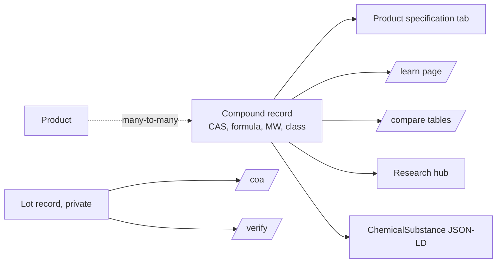

# 03 noviqpeptides.com

Status: draft. Client is actively building this out and answering build intake
questions, so treat it as in scope. Confirm the exact scope and price before
starting.

Platform: WordPress + WooCommerce, hosted externally.
Brand name: Noviq Peptides

## How to read this spec

Three levels of certainty, marked throughout so nothing gets mistaken for a
client commitment:

- Fact: client-provided or already agreed. Build to it.
- Recommended: our proposed architecture and approach. Sound, but confirm before
  it hardens into a promise.
- Placeholder: concrete data (prices, SKUs, catalog specifics, discount
  percentages) shown only to make the structure legible. Not client-confirmed.
  Real values come from `specs/10-intake.md` before launch.

## Client-provided facts

| Item | Value |
| --- | --- |
| Registrar | GoDaddy. We have account access and can manage the domains directly. |
| Products at launch | ~25 |
| People managing catalog and orders | 3 |
| Payment methods | "All methods". Client needs the live site to get final CC-processor approval. |
| Fulfilment | Shipping exclusively, no pickup or local delivery |
| Notifications | Wants CRM integration; fulfilment software undecided, open to suggestions |
| Order notification email | orders@noviqpeptides.com, not yet set up |
| White label | Vials say the actual peptide name, not "injectable peptide" |

## Copy constraint

Fact. Do not use the word "injectable" anywhere, per the client. The white-label
vial art carries the peptide name in place of "injectable peptide". Apply the
same clinical, RUO-only tone as the other sites: no health claims, no dosage, no
therapeutic language, in body copy, headings, meta descriptions, alt text, and
structured data.

## Design

Follow the shared minimalist design system in `specs/00-overview.md`: monochrome
base, single green accent, clean and uncluttered. Only the name, logo, and images
differ from the other sites. This is WordPress, not Dawn, so the palette and
principles carry over even though the theme mechanics differ. Use gray "IMAGE
TBD" placeholders until the designer delivers assets. Launch imagery is
brand-safe artwork we own, never competitor or stock imagery.

## Build direction

Recommended. Deliver this as a custom WooCommerce store: a purpose-built theme
for presentation and a small domain plugin that owns the data model, pricing
rules, and compliance logic. Keeping data and compliance in the plugin means a
theme change never touches them.

The alignment-only-vs-rebuild scope question still needs a client decision on
price and timeline (`specs/10-intake.md`, E4), but the recommendation is a build:
the design system and compliance behavior below cannot be reached by restyling a
stock theme.

Note on parent themes. Commercial parents such as Blocksy, Astra, Kadence, and
Flatsome ship their own `woocommerce.php`, which WooCommerce's template loader
ranks above any child-theme catalog template. That means the catalog cannot be
restyled into this design without overriding the parent on every surface. Budget
for owning the templates. If the client already holds a commercial parent
licence and wants to keep it, that is workable, but expect the same
template-override effort.

## Proposed information architecture

Recommended. Structure, not final content.

### Primary navigation

Catalog, Documentation, Learn, Standard, Wholesale, Journal.

### Routes and page inventory

Product and category permalinks depend on WooCommerce base settings; flush
rewrite rules after any base change (see implementation risks).

| Route | Purpose |
| --- | --- |
| `/shop/` | Product catalog |
| `/learn/{slug}` | Compound reference page, one per compound |
| `/research-hub/` | Compounds indexed by research area |
| `/compare/{slug}` | Side-by-side compound comparison |
| `/coa/` | COA and SDS library, published per lot |
| `/verify/` | Lot-number lookup returning that lot's certificate |
| `/quality-standard/` | The specifications every lot is released against |
| `/wholesale/` | Bulk and institutional purchasing |
| `/about/`, `/why-noviq/`, `/contact/` | Company pages |
| `/blog/` | Journal |
| `/policies/{shipping-returns,terms,privacy,cancellation,accessibility}/` | Policy pages |

### Taxonomies

Two distinct taxonomies rather than one flat list:

- Product categories (`product_cat`), the catalog structure.
- Research areas, a separate taxonomy applied to both compounds and products, so
  a compound is indexed by the research area it is studied in, independent of
  where its product sits in the catalog.

Exact category and research-area names are placeholder until the client confirms
the real catalog.

## Proposed data model

Recommended. This is the part worth getting right, because it is what keeps
chemistry consistent across the site.

Make a compound record the single source of truth. One record feeds the product
specification tab, the `/learn` page, `/compare` tables, `/research-hub`, and the
`ChemicalSubstance` structured data. Chemistry is never copied onto a product, so
correcting a molecular weight in one place corrects it everywhere.

| Concept | WordPress / WooCommerce |
| --- | --- |
| Multi-size product | Variable product on a global vial-size attribute, per-variation SKU and price |
| Single-size product | Simple product with a display attribute, not a one-option variable product |
| Category | `product_cat` term |
| Research area | Custom taxonomy on both compounds and products |
| Compound | Custom post type, public at `/learn/{slug}` |
| Product to compound | Many-to-many via repeated post meta |
| Lot | Private custom post type, backs `/coa` and `/verify` |
| Comparison | Custom post type, public at `/compare/{slug}` |
| Journal article | Standard post |
| Policy | Standard page under `/policies/` |

Data hygiene rules:

1. A value the client cannot substantiate is stored as an absent meta row, not an
   empty string or a zero, so templates render a blank rather than a figure that
   looks measured.
2. Register meta with `show_in_rest`, an explicit sanitize callback, and an
   explicit auth callback.
3. Sanitize numeric meta on WooCommerce post types to a normalized string. See
   implementation risks for why casting back to float hangs the process.

## Commerce behavior

Recommended approach; all figures placeholder until the client confirms
commercial terms (`specs/10-intake.md`).

- Volume breaks by quantity of the same variant, deepest tier met wins, discount
  applied to every unit, evaluated per variant so ten units spread across sizes
  do not qualify. Arithmetic in integer cents. Tier table is per-product meta so
  pricing can diverge per product without a code change. Whether volume breaks
  exist at all, and at what thresholds, is a client decision.
- Shipping: one US zone at launch, flat rate with a free-over threshold, both
  placeholder. Read the threshold from a single source so the cart and the copy
  cannot drift.
- Bundles, if any, are display-only groupings at launch; a real bundle product
  type is a follow-up.
- Subscribe and save, if wanted, is UI behind a feature flag that stays off until
  the paid WooCommerce Subscriptions extension is licensed. No recurring charge
  is faked.
- Reviews off store-wide until a real review programme exists, and
  `aggregateRating` stripped from JSON-LD, because an empty star row reads as a
  zero rating and invented testimonials on an RUO listing are an enforcement
  trigger.

## Compliance controls

Recommended, and the strongest reason to build rather than restyle. These align
with the client's RUO posture and the separation constraints in
`specs/00-overview.md`. Treat them as testable controls, not copy preferences.

1. 21-and-up age gate on entry. One-time interstitial, answer stored in a cookie
   for a year, works with JavaScript off, dismisses client-side when the cookie
   is present so a cached page cannot re-ask, and shows a refusal panel on
   decline. The page renders behind the overlay rather than redirecting, so
   crawlers index normally. Version the consent copy so a wording change is not
   treated as prior consent.
2. Checkout researcher attestation, validated server-side so stripping the
   checkbox still fails. Record the exact wording agreed and a timestamp on the
   order, not just a boolean, so revising the copy later does not rewrite what
   past buyers saw.
3. RUO notice from a single source on every product page, the cart, the checkout,
   and the footer. Do not paraphrase; the copy is the control. The empty cart
   does not fire the usual cart hook, so wire it there explicitly.
4. No therapeutic or medical claims anywhere, including alt text, meta
   descriptions, and structured data.
5. Never fabricate a Certificate of Analysis. The lot registry ships empty; `/coa`,
   `/verify`, and the product Documentation panel render a correct empty state
   until real documents from the analysing lab exist.
6. Every quantitative claim comes from a single source, and a null renders
   nothing, no placeholder and no zero.

## Proposed homepage

Recommended section order:

1. Hero: research-grade positioning, primary and secondary calls to action.
2. Credibility band: only substantiated figures appear; a null drops its cell.
3. Catalog, grouped by category.
4. Reference library: links to the `/learn`, `/compare`, `/coa`, and
   `/quality-standard` surfaces.
5. FAQ, including the RUO explanation from the single claims source.

## Known WordPress and WooCommerce implementation risks

Engineering lessons to encode so the build does not rediscover them:

- Flush rewrite rules unconditionally after any WooCommerce product or category
  base change, or product and category URLs 404.
- Complete WooCommerce's deferred installer in scripted setup. Woo defers part of
  its installer to the first admin request, which never happens in a scripted
  build, leaving analytics tables missing and the product-image placeholder
  uncreated.
- Disable WooCommerce "Coming soon" mode explicitly. It short-circuits every
  storefront URL before the theme loads and looks exactly like a broken theme.
- Sanitize numeric meta to a normalized string. `WC_Post_Data` rewrites float
  meta with `wc_float_to_string()` and re-saves; a callback that casts back to
  float recurses without bound and hangs.
- Set WooCommerce email colours to the brand palette during setup, or unset
  colour options emit repeated PHP warnings.

## Lab supplies and add-ons, compliance decision required

Recommended decision. If the catalog is to include lab supplies (diluent,
syringes, prep pads) or bacteriostatic-water add-ons, that intersects the
separation constraint in `specs/00-overview.md`: FDA warning letters have cited
sellers for offering bacteriostatic water alongside peptides, and bacteriostatic
water has its own separate storefront by design (`specs/01-bacwatermarket.md`).

Recommendation: do not sell bacteriostatic water on the peptide site, and confirm
whether injection consumables belong on an RUO research storefront at all. Any
reconstitution tooling stays arithmetic-only and is not framed as dosing. Tracked
in `specs/10-intake.md`, E6.

## Access needed

| Item | Status |
| --- | --- |
| WordPress admin login | TBD |
| Theme or page builder in use, for example Elementor, Blocksy, Kadence, custom | TBD |
| Hosting or SFTP access, if theme files need editing | TBD |
| Whether the site is live and taking orders, or staging | TBD |
| Staging environment available | TBD |
| Confirmation the production store is served entirely over HTTPS | Required before real card data |

Nothing in this repository deploys to WordPress. If we take on template work,
add a `noviqpeptides/` directory holding only the child theme or the specific
files we own, never a full WordPress copy.

## Payments

Fact. The client's responsibility, and the largest financial exposure across the
three sites. RUO peptides require a high-risk merchant account; mainstream
processors will terminate on detection. We do not select, configure, or hold
credentials for it. Disclose the product category to the processor in writing.
If unresolved at launch, ship phase one on manual payment only (purchase order,
bank transfer, invoice); any placeholder method used to exercise checkout must be
disabled before launch.

Record here once known: TBD

## Constraint inherited from the overview

This site must not link to bacwatermarket.com or fastpeptidetesting.com, and
must not share branding with them. See `specs/00-overview.md`.

Outbound links from here to the Shopify sites are lower risk than the reverse,
but stay out until the client accepts the tradeoff in writing.

## What this repository holds for this site

`noviqpeptides/` contains notes, exports, and any child theme files we own.
It does not contain a WordPress installation.

## Definition of done

- Data model and compliance logic live in the domain plugin and survive a theme
  change; the custom theme owns catalog, product, cart, and checkout templates.
- Age gate shown once, then never again, with and without JavaScript.
- Checkout blocked server-side until attestation ticked; value, wording, and
  timestamp recorded on the order.
- RUO notice present on product page, cart, checkout (including empty cart), and
  footer, from a single source.
- Volume breaks, if used, correct per variant with the deepest tier applied to
  every unit.
- Lot registry empty with a correct empty state on `/coa`, `/verify`, and the
  product Documentation panel.
- No competitor or stock imagery; brand-safe artwork or delivered photography
  only.
- No health, dosage, or therapeutic language anywhere in rendered output or
  metadata.
- Real price book and catalog in place, no placeholder prices or SKUs.
- Production served entirely over HTTPS.
- No page links to the other client sites.
- Test order completes end to end.
